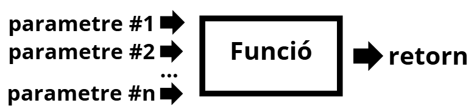
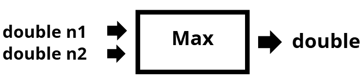
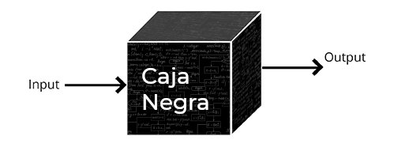

> Disposeu del següent canva que explica les funcions en C#.
> https://canva.link/p4g78nhmggbmiop

# Funcions

## Què és una funció?

Una funció **rep uns paràmetres** (pot tenir-ne diversos) i **sempre retorna un valor**.



## Implementar una funció

Exemple: una funció `Max` que rep dos `double` i retorna el més gran.



```csharp
public static double Max(double n1, double n2)
{
    double maxim;
    maxim = n1;
    if (n2 > n1)
    {
        maxim = n2;
    }
    return maxim;
}
```

El nom de les funcions en C# s'escriu en **PascalCase**: com el *camelCase*, però amb la primera lletra també en majúscula.

## Comentar les funcions

Les funcions s'han de comentar perquè el programador sàpiga com utilitzar-les correctament.

```csharp
/// <summary>
/// Retorna el valor màxim entre dos nombres de tipus double.
/// </summary>
/// <param name="n1">El primer nombre a comparar.</param>
/// <param name="n2">El segon nombre a comparar.</param>
/// <returns>El nombre més gran entre n1 i n2.</returns>
public static double Max(double n1, double n2)
{
    ...
}
```

> Si escrius `///` just a sobre d'una funció, Visual Studio genera automàticament l'estructura del comentari.

## La funció com una caixa negra

Un cop implementada i comentada, una funció es pot utilitzar **sense conèixer els detalls interns**: només cal saber els pràmetres què rep i què retorna.



## Crida a una funció (utilitzar una funció) 

### Amb valor literals

En aquest cas, la funció retorna un valor i aquest valor es mostra a pantalla.

```csharp
public static void Main(string[] args)
{
    Console.WriteLine(Max(2, 5));
}
```

```text
> 5
```

### Guardant el resultat en una variable

La funció retorna un valor i aquest es guarda en una variable.

```csharp
public static void Main(string[] args)
{
    double a, b, c;
    a = 10;
    b = 9;
    c = Max(b, a);
    Console.WriteLine(c);
}
```

```text
> 10
```

### Amb expressions com a paràmetres

La funció rep valors que previament s'han de calcular.

```csharp
public static void Main(string[] args)
{
    double a, b;
    a = 10;
    b = 9;
    Console.WriteLine(Max(a, b + 2));
}
```

```text
> 11
```

### Funcions dins de funcions

El resultat d'una funció es pot fer servir com a paràmetre d'una altra.

```csharp
public static void Main(string[] args)
{
    double a, b, c;
    a = 5;
    b = 6;
    c = 7;
    Console.WriteLine(Max(Max(a, b), c));
}
```

```text
> 7
```

### 📝 Exercici: quin resultat donarà?

```csharp
public static void Main(string[] args)
{
    double a, b, c;
    a = 5;
    b = 6;
    c = -200;
    c = Math.Max(Math.Max(Math.Max(a, b) * 5, c), 29);
    Console.WriteLine(c);
}
```

<details markdown="1">
<summary markdown="span">Mostra la solució</summary>

```text
> 30
```

</details>