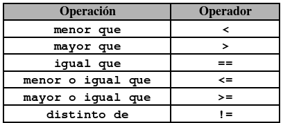
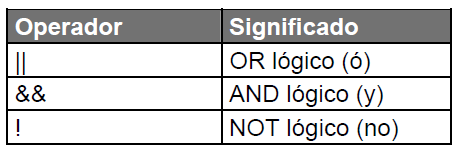
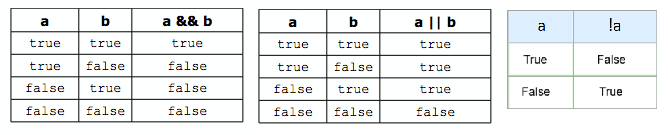
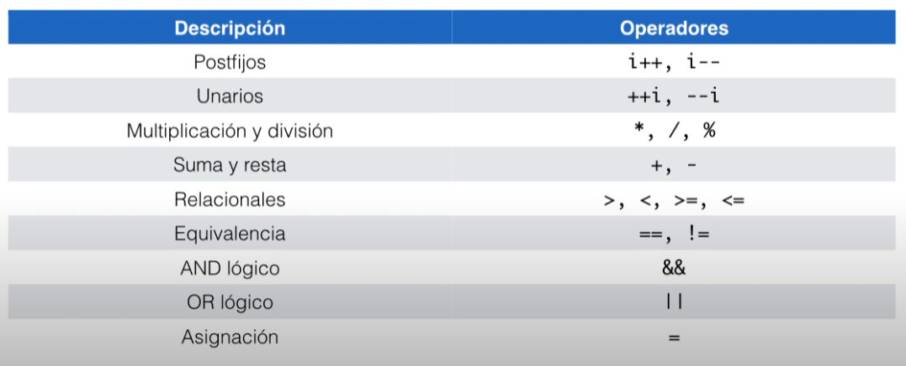
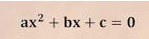
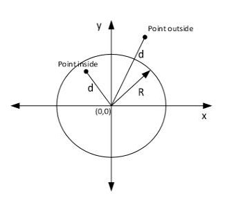
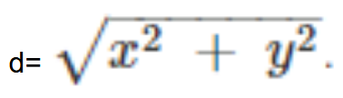

# Expressions booleanes

Una expressió booleana és una expressió que, quan s'avalua, **sempre dona `true` o `false`**.  

> En alguns llenguatges, com el **C**, no existeix el tipus booleà.  
> Llavors, el `0` vol dir **False**, i qualsevol altre número (normalment `1`) vol dir **True**.  

```csharp
int edat = 17;
bool majorEdat = edat >= 18;     // false
```

## Operadors de comparació

Comparen dos valors i retornen un `bool`.



```csharp
int edat = 16;
char lletra = 'b';

bool majorEdat = edat >= 18;       // false
bool teSetze = edat == 16;         // true
bool noEsZero = edat != 0;         // true
bool esLletraA = lletra == 'a';    // false
bool abansDeM = lletra < 'm';      // true (es comparen els codis ASCII)
```

## Operadors lògics

Serveixen per combinar expressions booleanes.



```csharp
int edat = 16;
bool esVip = true;

bool potEntrar = edat >= 18 || esVip;          // true 
bool adolescent = edat >= 12 && edat < 18;     // true 
bool menor = !(edat >= 18);                    // true 
```

### Taules de veritat

L'operador `&&` només és cert si **tots dos** són certs.  
L'operador `||` és cert si **almenys un** és cert.  
L'operador `!` **inverteix** el valor. Si és cert passa a fals, i viceversa.  



```csharp
int nota = 7;

bool aprovat = nota >= 5;                    // true
bool notable = nota >= 7 && nota < 9;        // true
bool extrem = nota == 0 || nota == 10;       // false
bool suspes = !aprovat;                      // false
```

## Precedència dels operadors

Quan en una expressió hi ha diversos operadors, s'avaluen en aquest ordre (de més a menys prioritat):



> L'operador `&&` té **més prioritat** que el `||`.  
> Els operadors aritmètics (`+`, `-`, `*`...) tenen **més prioritat** que els de comparació (`>`, `<`, `==`...).  
> L'operador `=` és el que té **menys prioritat**: primer es calcula tot, i al final es guarda.

```csharp
bool r1 = 2 + 3 > 4;                 // true  → (2 + 3) > 4
bool r2 = true || false && false;    // true  → true || (false && false)
bool r3 = (true || false) && false;  // false → primer el parèntesi
```

## Negar expressions booleanes

Negar una comparació és el mateix que fer servir la comparació **contrària**.

| Expressió negada<br>&nbsp; | Expressió equivalent<br>(no negada) |
|------------------|----------------------|
| `!(a < 0)`       | `a >= 0`             |
| `!(a <= 0)`      | `a > 0`              |
| `!(a > 0)`       | `a <= 0`             |
| `!(a >= 0)`      | `a < 0`              |
| `!(a == 0)`      | `a != 0`             |
| `!(a != 0)`      | `a == 0`             |

## Lleis de De Morgan

Per negar una expressió amb `&&` o `||`:

1. Es nega cada part.
2. L'operador `&&` es canvia per `||`  
   L'operador `||` es canvia per `&&`

```text
!(A && B)   →   !A || !B
!(A || B)   →   !A && !B
```

Exemples:

```csharp
!(a >= 0 && a <= 10)   →   !(a >= 0) || !(a <= 10)   →   a < 0 || a > 10
!(a == 0 || a > 10)    →   !(a == 0) && !(a > 10)    →   a != 0 && a <= 10
```

## Exercicis

### 📝 Exercici: escriu l'expressió booleana

Donat el codi següent:

```csharp
char c = Convert.ToChar(Console.ReadLine()!);
double angle = Convert.ToDouble(Console.ReadLine());
bool b;
```

Escriu l'expressió booleana que permet valorar cada cas:

1. `c` és una lletra minúscula
2. `c` és una lletra
3. `c` no és una lletra
4. `c` és una vocal
5. `c` és una consonant
6. `c` és un dígit numèric
7. `angle` és un angle obtús (més gran de 90 i menys de 180)
8. `b` és cert
9. `b` és fals

<details markdown="1">
<summary markdown="span">Mostra la solució</summary>

```csharp
// 1. c és una lletra minúscula
c >= 'a' && c <= 'z'

// 2. c és una lletra
(c >= 'a' && c <= 'z') || (c >= 'A' && c <= 'Z')

// 3. c no és una lletra
!((c >= 'a' && c <= 'z') || (c >= 'A' && c <= 'Z'))

// 4. c és una vocal
c == 'a' || c == 'e' || c == 'i' || c == 'o' || c == 'u' ||
c == 'A' || c == 'E' || c == 'I' || c == 'O' || c == 'U'

// 5. c és una consonant (és una lletra i no és una vocal)
((c >= 'a' && c <= 'z') || (c >= 'A' && c <= 'Z')) &&
!(c == 'a' || c == 'e' || c == 'i' || c == 'o' || c == 'u' ||
  c == 'A' || c == 'E' || c == 'I' || c == 'O' || c == 'U')

// 6. c és un dígit numèric
c >= '0' && c <= '9'

// 7. angle és un angle obtús
angle > 90 && angle < 180

// 8. b és cert
b == true 

// 9. b és fals
b == false
```
</details>

### 📝 Exercici: Lleis de De Morgan

Escriu el negat de les expressions booleanes següents, **sense fer servir `!` davant de parèntesis**:

1. `!b && c != '.'`
2. `x < 3 || y == 0 && z == 0`
3. `('a' < x) && (x <= 'z')`
4. `(x != 'a') && (x != 'e') && (x != 'i') && (x != 'o') && (x != 'u')`

<details markdown="1">
<summary markdown="span">Mostra la solució</summary>

```csharp
// 1.
!(!b && c != '.')
b || c == '.'

// 2.
!(x < 3 || (y == 0 && z == 0))
x >= 3 && !(y == 0 && z == 0)
x >= 3 && (y != 0 || z != 0)

// 3.
!(('a' < x) && (x <= 'z'))
x <= 'a' || x > 'z'

// 4. 
x == 'a' || x == 'e' || x == 'i' || x == 'o' || x == 'u'
```

</details>

### 📝 Exercici: equació de segon grau

Escriu una expressió booleana que valori `true` si les variables reals `a`, `b` i `c` satisfan l'equació de segon grau per a un valor concret de `x`.



<details markdown="1">
<summary markdown="span">Mostra la solució</summary>

```csharp
a * x * x + b * x + c == 0
```

</details>

### 📝 Exercici: punt dins d'un cercle

Escriu una expressió booleana que valori `true` si un punt amb coordenades reals `(x, y)` es troba dins d'un cercle de radi real `r` centrat a l'origen `(0, 0)`.



Per calcular la distància `d` d'un punt a l'origen de coordenades, fes servir la fórmula:



<details markdown="1">
<summary markdown="span">Mostra la solució</summary>

> El punt és dins del cercle si la seva distància a l'origen és **menor o igual** que el radi.

```csharp
Math.Sqrt(x * x + y * y) <= r
```

</details>

### 📝 Exercici: venedors

Tenim 3 variables (`sellsMichael`, `sellsPeter` i `sellsJohn`) que contenen la quantitat d'euros que ha venut cada venedor durant un any.

Escriu expressions booleanes que valorin `true` si es compleixen les condicions següents:

1. Michael és el millor venedor.
2. Cap venedor ha venut menys de 20.000 €.
3. Algun venedor ha venut més de 5.000 €.
4. La mitjana de les 3 quantitats és superior a 8.000 €.
5. La mitjana de les 3 quantitats és superior a 8.000 € o hi ha algun venedor que ha venut menys de 4.000 €.
6. Peter no és el millor venedor.

<details markdown="1">
<summary markdown="span">Mostra la solució</summary>

```csharp

// 1. Michael és el millor venedor
sellsMichael > sellsPeter && sellsMichael > sellsJohn

// 2. Cap venedor ha venut menys de 20.000 €
sellsMichael >= 20000 && sellsPeter >= 20000 && sellsJohn >= 20000

// 3. Algun venedor ha venut més de 5.000 €
sellsMichael > 5000 || sellsPeter > 5000 || sellsJohn > 5000

// 4. La mitjana és superior a 8.000 €
(sellsMichael + sellsPeter + sellsJohn) / 3.0 > 8000

// 5. La mitjana és superior a 8.000 € o algun ha venut menys de 4.000 €
(sellsMichael + sellsPeter + sellsJohn) / 3.0 > 8000 ||
sellsMichael < 4000 || sellsPeter < 4000 || sellsJohn < 4000

// 6. Peter no és el millor venedor
!(sellsPeter > sellsMichael && sellsPeter > sellsJohn)
// o, aplicant De Morgan:
sellsPeter <= sellsMichael || sellsPeter <= sellsJohn
```

</details>
